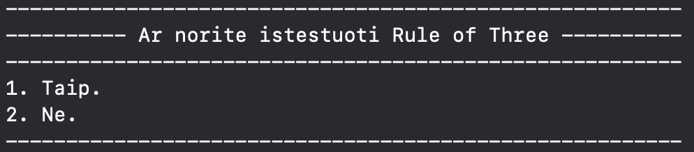

#### [**Nuoroda į versiją 2.0**](#versija-20---patobulinta-15-versija)

# Studentų galutinio įvertinimo skaičiavimo programa
## Programos tikslas
Apskaičiuoti pateiktų studentų galutinį įvertinimą, pagal nurodytą formulę:
### galutinis = 0.4 * vidurkis/mediana + 0.6 * egzaminas

## Programos versijos
### Versija 0.1:
- Programa leidžia įvesti studentų duomenis rankiniu būdu arba atsitiktinai sugeneruoti jų balus, taip pat juos nuskaityti iš failo.
- Galima pasirinkti, kaip bus pateikiamas galutinis balas: vidurkis, mediana arba abu variantai.
- Rezultatus galima surikiuoti pagal studentų vardus arba pavardes.

### Versija 0.2 – patobulinta 0.1 versija:
- Pridėta galimybė generuoti studentų duomenų failus.
- Studentus galima suskirstyti į dvi grupes pagal galutinį balą.
- Įtrauktas pasirinkimas rikiuoti rezultatus pagal galutinį įvertinimą.

### Versija 0.3 – patobulinta 0.2 versija:
- Pridėta funkcija, kuri atspausdina rankiniu būdu įvestų studentų vietą atmintyje.
- Sukurtos dvi atskiros programos versijos: list ir vector.
-Atlikta konteinerių spartos analizė.

### Versija 1.0 – patobulinta 0.3 versija:
- Pridėtos dvi papildomos studentų rūšiavimo į dvi gropes strategijos.
- Atlikta studentų rūšiavimo spartos analizė.

### Versija 1.1 - patobulinta 1.0 versija:
- Sukurta nauja vector versija, kur _struct_ pakeista į _class_.
- Atlikta struktūrų analizė.

### Versija 1.2 - patobulinta 1.1 versija:
- Relizuota "Rule of Three".
- Pritaikyti perdengti įvesties ir išvesties metodai.

### Rule of Three
#### Destruktorius
```bash
~studentas() {
        var_.clear();
        pav_.clear();
        paz_.clear();
        gal_vid_ = 0.0;
        gal_med_ = 0.0;
        egz_ = 0;
        n_ = 0;
        suma_ = 0;
}
```
#### Kopijavimo konstruktorius
```bash
      studentas(const studentas& kitas)
        : var_(kitas.var_),
          pav_(kitas.pav_),
          paz_(kitas.paz_),
          egz_(kitas.egz_),
          gal_vid_(kitas.gal_vid_),
          gal_med_(kitas.gal_med_),
          n_(kitas.n_),
          suma_(kitas.suma_){}
```

#### Priskyrimo operatorius (copy assignment)
```bash
      studentas& operator=(const studentas& kitas) {
        studentas temp(kitas);
        if (this == &kitas) {
            return *this;
        }
        std::swap(var_, temp.var_);
        std::swap(pav_, temp.pav_);
        std::swap(paz_, temp.paz_);
        std::swap(egz_, temp.egz_);
        std::swap(gal_vid_, temp.gal_vid_);
        std::swap(gal_med_, temp.gal_med_);
        std::swap(n_, temp.n_);
        std::swap(suma_, temp.suma_);
        return *this;
    }
```

### Perdengti metodai
- ### Įvesties operatorius `operator >>`

Vartojas gali įvesti studento duomenis naudodamas `cin >> studentas` arba `fin >> studentas`

Prieš naudojant operatorių galima nustatyti įvesties rėžimą: įvestis rankiniu būdu ar įvestis sugeneruojama (automtiškai parinkta rankinis įvedimas)
- rankinis būdas: `ivestis = ivestis_rezimas::rankinis;`
- generavimas: `ivestis = ivestis_rezimas::generuojamas;`

Vartotojui reikės sukurti failą su duomenimis arba juos įvesti:
- vardą
- pavardę
- n.d. skaičių
- pažymius
- egzamino pažymį
  
(jei duomenys generuojami pakaks įvesti vardą ir pavardę).

- ### Išvesties operatorius `operator <<`

Vartotojas gali išvesti duomenis naudodamas `cout << studentas`arba `fout << studentas`

Prieš naudojant operatorių galima nustatyti išvesties rėžimą: išveda galutinį balą apskaičiuotą pagal vidurkį, medianą arba abu (automatiškai parinkta abu)
- vidurkis: `isvestis = isvesties_rezimas::vidurkis;`
- mediana: `isvestis = isvesties_rezimas::mediana;`
- abu: `isvestis = isvesties_rezimas::abu;`

Atspausdinami duomenys
- vardas
- pavardė
- galutinis rezultatas

### Versija 1.5 - patobulinta 1.2 versija:
- Sukurta bazinė (abstrakti) klasė _žmogus_.
- Klasė _studentas_ kuriama iš bazinės klasės _žmogus_.

#### Klasė _žmogus_

```bash
class zmogus{
protected:
    string var_;
    string pav_;
    
public:
    zmogus(): var_(""), pav_("") {}
    zmogus(const string& vardas, const string& pavarde): var_(vardas), pav_(pavarde) {}
    
    virtual string vardas() const = 0;
    virtual string pavarde() const = 0;
    
    //Destruktorius
    virtual ~zmogus() {
            var_.clear();
            pav_.clear();
    }
    
};
```
#### Klasė _studentas_

```bash
class studentas: public zmogus{...)
```

#### Sukurtos bazinės klasės _žmogus_ objektų kūrimas (`zmogus z`) yra negalimas:


taip pat galima patikrinti su komanda `is_abstract<zmogus>::value`.

### Versija 2.0 - patobulinta 1.5 versija:
- Sukurta dokumentacija naudojant _Doxygen_.
- Realizuoti Unit Testai naudojant _Google Tests_.

#### Doxygen dokumentacija

<a href="https://agnedzemydaite.github.io/Objektinis_2/" target="_blank">Doxygen dokumentacija</a>


#### Unit Testai
Unit testai iškarpa:
```bash
TEST(SkaiciavimoTestai, GalutnisVidurkis) {
    studentas s;
    s.setPaz({8, 10});
    s.setEgz(10);
    s.setSuma(18.0);
    s.setN(2.0);
    s.vidurkis();
    EXPECT_NEAR(s.gal_vid(), 9.6, 1e-6);
}
```

Paleidus testus gauname rezultatą:


## Išsamus naujausios versijos veikimo principas
### Vartotojas gali pasirinkti, ar nori generuoti studentų duomenų failus:


<b>Pasirinktus 1 variantą:</b>
<p>Programa sugeneruoja 5 atsitiktinius studentų sąrašų failus, sudarytus iš: 1 000, 10 000, 100 000, 1 000 000, 10 000 000 įrašų.</p>

### Vartotojas gali pasirinkti, ar nori ištestuoti _Rule of Three_:


<b>Pasirinkus 1 variantą:</b>
<p>Sukuriamas tekstinis failas, kur parodoma, kaip pasikeitė studentai: </p>


### Vartotojas gali pasirinkti, kaip įvesti studentų duomenis:


<b>Pasirinkus (1-3) variantus:</b> 
<p>Ekrane yra atspausdinamas kiekvieno studento saugojimo atmintyje adresas.</p>


### Vartotojas gali pasirinkti, pagal kokį kriterijų nori surūšiuoti studentų duomenis į failus vargsiukai.txt ir kietiakai.txt:


<b>Studentai į grupes skirtstomi pagal: </b>
- Studentai, kurių galutinis balas < 5.0 yra “vargšiukai”.
- Studentai, kurių galutinis balas >= 5.0 galėtume yra "kietiakiai".

### Vartotojas gali pasirinkti, kurią rūšiavimo strategiją naudoti:


### Vartotojas gali pasirinkti, pagal kokius kriterijus bus apskaičiuotas ir atspausdintas galutinis įvertinimas:


### Vartotojas gali pasirinkti, ar rezultatus rikiuoti pagal studentų vardus, pavardes ar galutinį rezultatą:


### Vartotojas gali pasirinkti ar duomenis spausdinti į ekraną ar į failus:


### Vartotojas gali pasirinkti, ar nori kad į ekraną atspausdintų visus studentų duomenis:


<b>Programos išvedimo forma:</b>

| Vardas  | Pavardė       | Galutinis (Vid.) | Galutinis (Med.) |
|---------|---------------|-----------------|-----------------|
| Arvydas | Sabonis       | x.xx            | x.xx            |
| Rimas   | Kurtinaitis   | y.yy            | y.yy            |
| ...     | ...           | ...             | ...             |


<b>Programos pabaigoje atspausdinama, kiek laiko (ms) užtruko spartos analizėje testuotos funkcijos.</b>

## Klaidų tikrinimas
- Programa tikrina skaičių įvedimą, neleidžiant įvesti ne skaitmenų. Pvz.: a5, penki.
- Programa tikrina ar vartotojas nieko neįvedė t.y. paspaudė "enter" mygtuką.
- Programa neleidžia įvesti balų, kurie nėra sveikieji skaičiai intervale [1; 10].
- Programa įvedus vardą ir pavardę praleidžia simbolius faile, kurie nėra skaitmenys.
- Programa praleidžia skaičius faile, kurie nėra sveikieji skaičiai intervale [1; 10].

<b> Padarius klaidą, vartotjui pranešama, kad buvo padarytą klaida ir leidžia įvesti iš naujo. </b>

## Spartos tyrimas
**Testavimo sistemos parametrai:**
- Apple M3 Pro (11-core CPU)
- 18 GB RAM
- 512 GB SSD


Versijų sparta buvo matuojama su 5 tekstiniais failais, kuriose ND skaičius yra 10:
- 1000.txt
- 10000.txt
- 100000.txt
- 1000000.txt
- 10000000.txt

Matavome 3 dalykus:
- Duomenų nuskaitymą iš failo.
- Studentų rūšiavimą į dvi grupes.
- Duomenų išvedimą į du naujus failus.

<b>Matavimai buvo atliekami 5 kartus ir apskaičiuotas vidurkis.</b>

### Konteinerių spartos palyginimas

### Vector versija

| Įrašų skaičius | Nuskaitymas | Rušiavimas | Išvedimas | Bendras laikas |
-----------------|-------------|------------|-----------|----------------|
|1000            |  0.002 s    | 0 s        | 0.003 s   |    0.005 s     |
|10 000          |   0.006 s   |  0.001 s   | 0.033 s   |     0.04 s     |
|100 000         |   0.051 s   |  0.015 s   |  0.332 s  |     0.398 s    | 
|1 000 000       |   0.494 s   |   0.044 s  |    0.5 s  |    1.038 s     |
|10 000 000      |   4.885 s   |  0.465 s   |  5.092 s  |    10.442 s    |

### List versija

| Įrašų skaičius | Nuskaitymas | Rušiavimas | Išvedimas | Bendras laikas |
-----------------|-------------|------------|-----------|----------------|
|1000            |   0.003 s   |  0 s       |  0.003 s  |    0.006 s     |
|10 000          |    0.014 s  |   0.005 s  |  0.042 s  |    0.061 s     |
|100 000         |    0.129 s  |  0.021 s   |  0.432 s  |    0.582 s     | 
|1 000 000       |   1.289 s   |   0.114 s  |  0.705 s  |    2.108 s     |
|10 000 000      |  12.786 s   |  1.407 s   |   8.59 s  |    22.783 s    |


### Išvados

Abejoms versijoms atlikus spartos tyrimą, matome, kad visais atvejais *Vector* versija buvo greitesnė. Su mažesniu įrašų skaičiumi abiejų versijų greitis labai neišsiskiria, tačiau lyginant 1 mln. ir 10 mln. įrašus, pastebime, kad naudojant vektoriaus konteinerio tipą funkcijos veikia dvigubai greičiau.

### Rūšiavimo strategijų palyginimas

### Vector versija

| Įrašų skaičius | 1 strategija | 2 strategija | 3 strategija |
-----------------|--------------|--------------|--------------|
|1000            |      0  s    |    0 s       |    0 s       |
|10 000          |     0.001 s  |    0.004 s   |    0.001 s   |
|100 000         |     0.015 s  |    0.045 s   |    0.005 s   |
|1 000 000       |    0.044 s   |    0.138 s   |    0.025 s   |
|10 000 000      |    0.465 s   |    2.218 s   |    0.180 s   |


### List versija

| Įrašų skaičius | 1 strategija | 2 strategija | 3 strategija |
-----------------|--------------|--------------|--------------|
|1000            |      0  s    |    0.001 s   |    0 s       |
|10 000          |     0.005 s  |    0.009 s   |    0.002 s   |
|100 000         |     0.021 s  |    0.045 s   |    0.019 s   |
|1 000 000       |    0.114 s   |    0.672 s   |    0.079 s   |
|10 000 000      |    1.407 s   |   12.166s    |    1.063 s   |


### Išvados

<p>
Abejose versijose lyginant 1 ir 2 strategiją, gavome, kad 1 veikė žymiai greičiau, tai lėmė, kad 2 strategijoje studentų konteinerį reikėjo surikiuoti didėjimo tvarka.
</p>
<p>
3 strategija buvo paremta 1-ąja, pridėdant algortimus, kurie paspartino jos veikimą.
</p>
<p>
Lyginant <em>vector</em> ir <em>list</em> konteirių spartą, matome, kad visose strategijose <em>vector</em> veikė gan greičiau nei <em>list</em>.
</p>

### Struktūros ir klasės spartos palyginimas

Buvo naudojama programa su _vector_ konteineriu ir 3 strategija.

### _Class_ versija

<table>
  <tr>
    <th>Įrašų sk</th>
    <th></th>
    <th>O1</th>
    <th>O2</th>
    <th>O3</th>
  </tr>
  
  <!-- Pirmas blokas (įrašai) -->
  <tr>
    <td rowspan="4">100 000</td>
    <td>Nuskaitymas</td>
    <td>0.058 s</td>
    <td>0.058 s</td>
    <td>0.057 s</td>
  </tr>
  <tr>
    <td>Rūšiavimas</td>
    <td> 0.013 s</td>
    <td> 0.011 s </td>
    <td> 0.012 s</td>
  </tr>
  <tr>
    <td>Išvedimas</td>
    <td> 0.055 s </td>
    <td> 0.055 s </td>
    <td> 0.051 s </td>
  </tr>
  <tr>
    <td><b>Bendras laikas</b></td>
    <td> <b>0.126 s</b> </td>
    <td> <b>0.124 s</b> </td>
    <td><b> 0.12 s</b> </td>
  </tr>

  <!-- Antras blokas (įrašai) -->
  <tr>
    <td rowspan="4">1 000 000</td>
    <td>Nuskaitymas</td>
    <td> 0.552 s </td>
    <td> 0.568 s </td>
    <td> 0.57 s </td>
  </tr>
  <tr>
    <td>Rūšiavimas</td>
    <td> 0.06 s </td>
    <td> 0.061 s </td>
    <td> 0.059 s </td>
  </tr>
  <tr>
    <td>Išvedimas</td>
    <td> 0.474 s </td>
    <td> 0.465 s </td>
    <td> 0.468 s</td>
  </tr>
  <tr>
    <td><b>Bendras laikas</b></td>
    <td> <b> 1.086 s  </b></td>
    <td> <b> 1.093 s </b></td>
    <td><b> 1.096 s </b></td>
  </tr>
  <!-- Failo dydis atskirai -->
  <tr>
    <td></td>
    <td>Failo dydis</td>
    <td> 149 KB </td>
    <td> 148 KB </td>
    <td> 181 KB </td>
  </tr>
</table>

### _Struct_ versija

<table>
  <tr>
    <th>Įrašų sk</th>
    <th></th>
    <th>O1</th>
    <th>O2</th>
    <th>O3</th>
  </tr>
  
  <!-- Pirmas blokas (įrašai) -->
  <tr>
    <td rowspan="4">100 000</td>
    <td>Nuskaitymas</td>
    <td>0.049 s</td>
    <td>0.048 s</td>
    <td>0.048 s</td>
  </tr>
  <tr>
    <td>Rūšiavimas</td>
    <td> 0.005 s</td>
    <td> 0.005 s </td>
    <td> 0.005 s</td>
  </tr>
  <tr>
    <td>Išvedimas</td>
    <td> 0.058 s </td>
    <td> 0.061 s </td>
    <td> 0.055 s </td>
  </tr>
  <tr>
    <td><b>Bendras laikas</b></td>
    <td> <b>  0.113 s </b> </td>
    <td> <b> 0.115 s </b></td>
    <td> <b>0.108 s</b> </td>
  </tr>

  <!-- Antras blokas (įrašai) -->
  <tr>
    <td rowspan="4">1 000 000</td>
    <td>Nuskaitymas</td>
    <td> 0.485 s </td>
    <td> 0.473 s </td>
    <td> 0.469 s </td>
  </tr>
  <tr>
    <td>Rūšiavimas</td>
    <td> 0.03 s </td>
    <td> 0.028 s </td>
    <td> 0.28 s </td>
  </tr>
  <tr>
    <td>Išvedimas</td>
    <td> 0.498 s </td>
    <td> 0.498 s </td>
    <td> 0.494 s </td>
  </tr>
  <tr>
    <td><b>Bendras laikas</b></td>
    <td> <b> 1.012 s </b> </td>
    <td> <b>  0.999 s </b> </td>
    <td> <b> 0.99 s </b> </td>
  </tr>
  <!-- Failo dydis atskirai -->
  <tr>
    <td></td>
    <td>Failo dydis</td>
    <td> 163 KB </td>
    <td> 162 KB </td>
    <td> 178 KB </td>
  </tr>
</table>

### Išvados

Programa su _struct_ veikia siek tiek greiciau nei su _class_, tačiau žymaus skirtumo nėra. Taip pat nedaug skiriasi ir flag'ų greičiai. Su _vector_ matome, kad flag'ų greičiai O1 > O2 > O3, tačiau tokio stabilumo negalima pamatyti su _class_.

## Įdiegimo instrukcija (Linux ir MacOS)

#### Reikalavimai
- C++ kompiliatorius (C++20 versija)
- CMake (3.25 ar naujesnė versija)
- make – kompiliavimo ir vykdomojo failo generavimo įrankis
- Git - paskirstytos versijų kontrolės sistema

#### Programos įdiegimo žingsniai:
- Įsitikinti, kad kompiuteryje turite C++ kompiliatorių, cmake, make ir git, jei neturite - įsidiekite.
- Atsidarykite komandinę eilutę (terminalą) savo kompiuteryje ir įveskite šias komandas:
  -  `git clone -b v1.5 https://github.com/agnedzemydaite/Objektinis_2.git`
  -  `cd Objektinis_2`
- Sukurkite katalogą, kuriame bus generuojami "build" failai:
  - `mkdir build`
  - `cd build`
- Priklausomai nuo norimos naudoti versijos, įveskite:
  - Vector versijai: `cmake -DUSE_VECTOR=ON ..`
  - List versijai: `cmake -DUSE_LIST=ON ..`
  - Vector class versijai: `cmake -DUSE_VECTOR_CLASS=ON ..`
- Kompiliuokite projektą:
  - `cmake --build .`
- Paleiskite testus:
- `./testavimas --gtest_color=yes --gtest_print_time=1`
- Paleiskite programą:
  - `./Studentai`
- (Pasirinktinai) Jei norite iš naujo sukompiliuoti nuo nulio:
  - Ištrinkite `build` katalogą: `rm -rf build`
  - Ir pakartokite ankstesnius žingsnius.

## Naudojimo instrukcija

Norėdami sužinoti, kaip veikia programa, kokius veiksmus galima atlikti ir kokie pasirinkimai galimi,
peržiūrėkite skyrių [**Išsamus galutinės versijos veikimo principas**](#išsamus-naujausios-versijos-veikimo-principas)


Trumpai:
- Paleiskite programą komandą: `./Studentai`
- Sekite instrukcijas, pateiktas programos lange.
